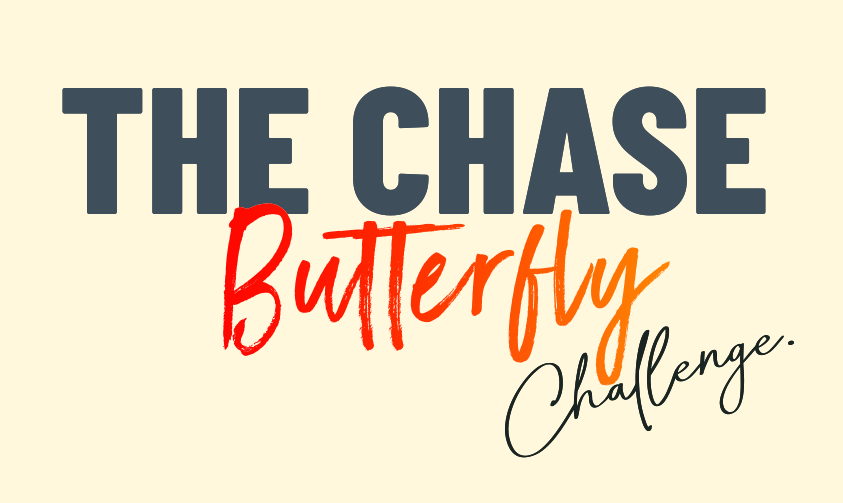

# THE CHASE - Butterfly Challenge
THE CHASE - Butterfly Challenge の台本作成

### 興味を持ってほしい人

- どんなアプリを作れば良いか分からない人
- 目標って言われても分からない人
- 衝動で動いてしまう人（やり始めてもいつの間にか手つかずになっている）

### 過去と同じことをやっていても、その延長線上には過去と同じ現実しかない

## 理不尽さへの耐性
私は勉強、好きな方です。だって勉強というのは、努力すれば結構きちんと結果が付いてくるから。勉強って、その意味でかなり「思い通りになる」事なのです。

一方世の中は、理不尽なことが多いです。「なんで？？」と言いたくなる事が沢山。でも渡って行かなきゃいけない。実は、その「理不尽さ」への耐性をつける事が、勉強の１つの意味じゃないかと思います。

これは本当に理不尽なのか？不思議としか言いようのないことか？自分の力で何とかできることではないのか？その見極めが、「あれだけやったけどダメなら仕方ない」になるのです。精一杯努力したから、諦めもつく。

どうにかなる事は努力してみる。どうにもならないことは、それとして諦める。それって、悔いのない生き方に繋がっていると思いますよ。
